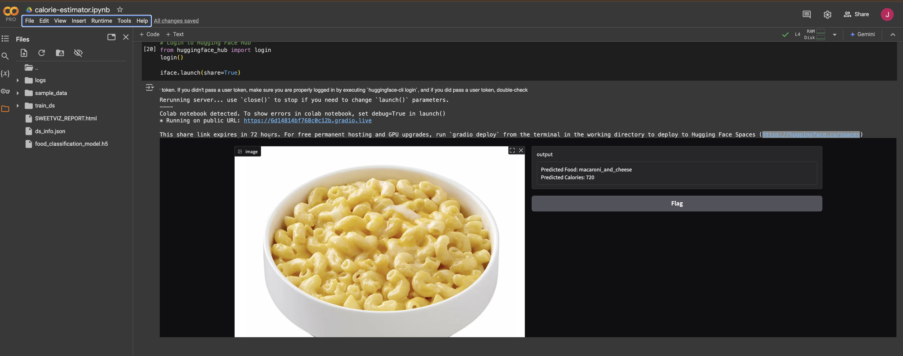
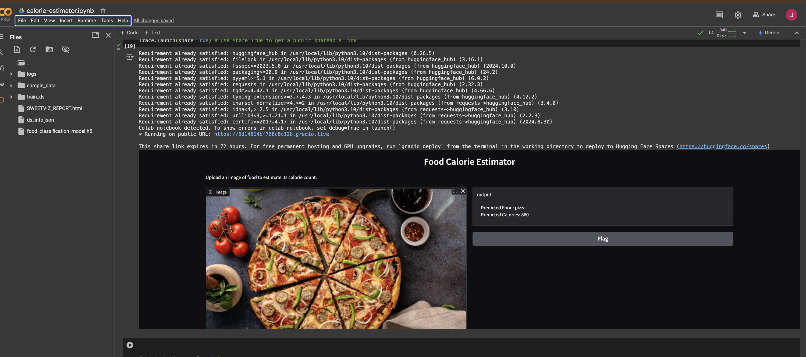
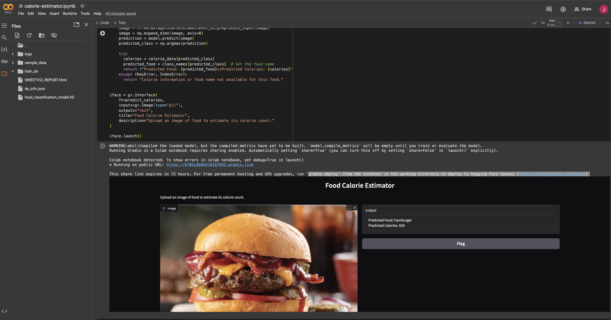
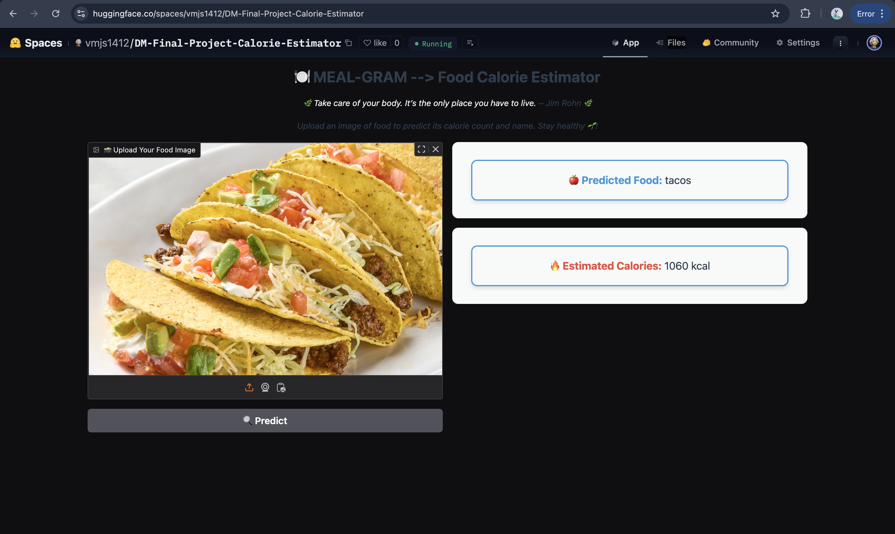
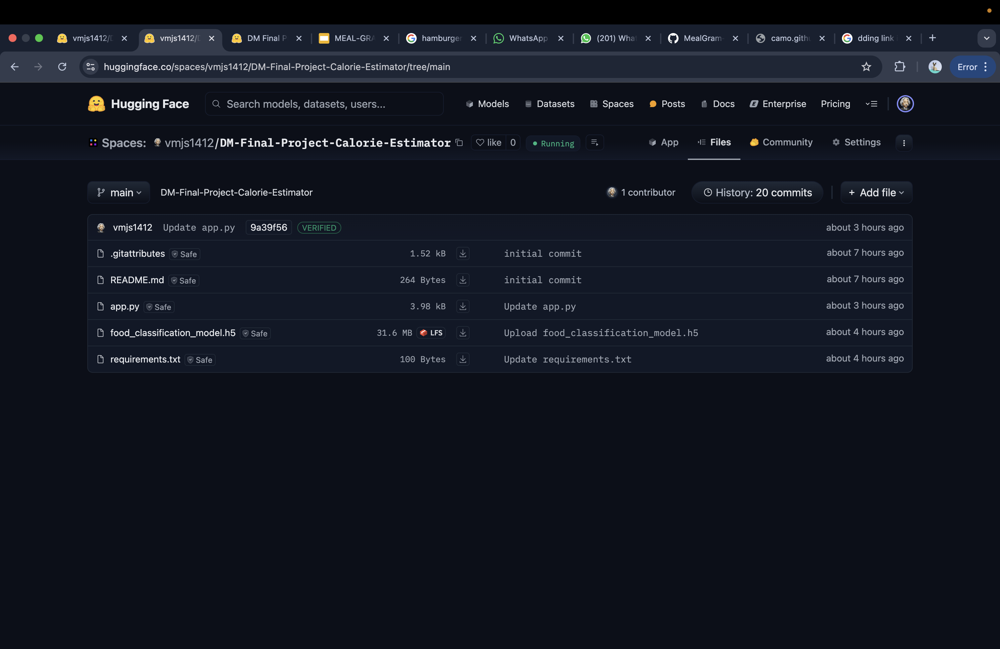

# MealGram : A convolutional neural network (CNN) powered Image-Based Food Calorie Estimator

## HUGGING FACE SPACES MODEL DEPLOYMENT LINK WITH UI - [hugging-space-url](https://huggingface.co/spaces/vmjs1412/DM-Final-Project-Calorie-Estimator)

## Project Overview
MealGram is an advanced machine learning system that estimates calorie content from food images, making calorie tracking more accessible and user-friendly. The project follows the CRISP-DM (Cross-Industry Standard Process for Data Mining) methodology.

## CRISP-DM Implementation

### 1. Business Understanding
- **Objective**: Develop an accurate and user-friendly system for estimating calorie content from food images
- **Success Criteria**:
  - Model accuracy: 85% top-1 accuracy, 95% top-5 accuracy
  - Calorie estimation: Within ±20% error margin of standard references
  - User satisfaction: Positive feedback on app usability

### 2. Data Understanding
- **Dataset**: Food-101
  - 101,000 images across 101 food categories
  - Real-world food images with varying lighting and presentation
  - Balanced dataset with 1,000 images per category
  - https://www.kaggle.com/datasets/dansbecker/food-101
- **Data Quality**:
  - High-resolution images
  - Multiple angles and presentations of each food type
  - Real-world conditions capturing authentic scenarios

### 3. Data Preparation
- **Image Preprocessing**:
  - Resizing to 224x224 pixels
  - MobileNetV2 specific preprocessing
  - Batch processing with TensorFlow data pipeline
- **Data Pipeline**:
  - Efficient data loading using TensorFlow datasets
  - Batch size: 32
  - Automated prefetching for optimization

### 4. Modeling
- **Architecture**:
  - Base model: MobileNetV2 (pre-trained on ImageNet)
  - A convolutional neural network (CNN) is a type of artificial neural network that uses deep learning to process and analyze data, particularly images
  - Additional layers:
    - Global Average Pooling
    - Dense layer (256 units, ReLU activation)
    - Dropout (0.5)
    - Output layer (101 units, Softmax activation)
- **Training Configuration**:
  - Optimizer: Adam (learning rate: 0.001)
  - Loss: Sparse Categorical Crossentropy
  - Metrics: Accuracy and Top-5 Accuracy
  - Epochs: 20

### 5. Evaluation
The model's performance was evaluated using multiple metrics and visualizations:
- **Core Metrics**:
  - Test Accuracy
  - Top-5 Accuracy
  - Loss curves
- **Visualizations**:
  - Training vs Validation Accuracy
  - Training vs Validation Loss
  - Confusion Matrix
  - t-SNE Feature Space Visualization
  - ROC Curve and AUC
  - Feature Importance Analysis

### 6. Deployment
- **Interface**: Gradio web interface for easy interaction
- **Features**:
  - Image upload capability
  - Real-time predictions
  - Calorie estimation display
- **Platform**: Deployed on Hugging Face Spaces for public access

## Model Architecture
```
Model: Sequential
Base: MobileNetV2
_________________________________________________________________
Layer (type)                Output Shape              Params    
=================================================================
mobilenetv2_1.00_224 (Model) (None, 7, 7, 1280)      2,257,984
global_average_pooling2d    (None, 1280)             0         
dense                       (None, 256)               327,936   
dropout                     (None, 256)               0         
dense_1                     (None, 101)               25,957    
=================================================================
Total params: 2,611,877
Trainable params: 353,893
Non-trainable params: 2,257,984
```

## Model Performance Visualizations

### Inference Results
The model has been tested on various food items through the Gradio interface, demonstrating robust performance across different food categories:

1. **Mac and Cheese Detection**
   
   - Successfully identified mac and cheese in a bowl
   - Clean prediction with high confidence
   - Interface shows predicted food type and estimated calories

2. **Pizza Detection**
   
   - Accurately recognized a pizza with toppings
   - Demonstrated ability to handle complex food items with multiple ingredients
   - Clear visualization of the prediction interface

3. **Hamburger Detection**
   
   - Correctly identified a hamburger with multiple layers
   - Showed robustness in handling composed food items
   - Accurate calorie estimation for multi-component foods
  
4. **Hugging Face Demo**
     
     
   

These inference results showcase the model's capability to:
- Handle different food presentations
- Process various lighting conditions
- Recognize both simple and complex food items
- Provide real-time predictions through the web interface

## Requirements
- TensorFlow 2.x
- Python 3.7+
- Additional libraries:
  - tensorflow_datasets
  - numpy
  - matplotlib
  - scikit-learn
  - pandas
  - seaborn
  - gradio

## Usage
1. Install dependencies:
```bash
pip install tensorflow tensorflow_datasets numpy matplotlib scikit-learn pandas seaborn gradio
```

2. Run the application:
```python
python app.py
```

3. Upload a food image through the Gradio interface to get calorie estimation.

## Future Improvements
1. Expand the dataset to include more food categories
2. Implement portion size estimation
3. Add nutritional information beyond calories
4. Enhance model robustness through additional data augmentation
5. Develop mobile application for easier access

## Contributors
Lakshmi Sriya Amperayani

Jayasurya Murali

Veera Venkata Vijaya Subhash

## License
This project is licensed under the MIT License - see the LICENSE file for details.
